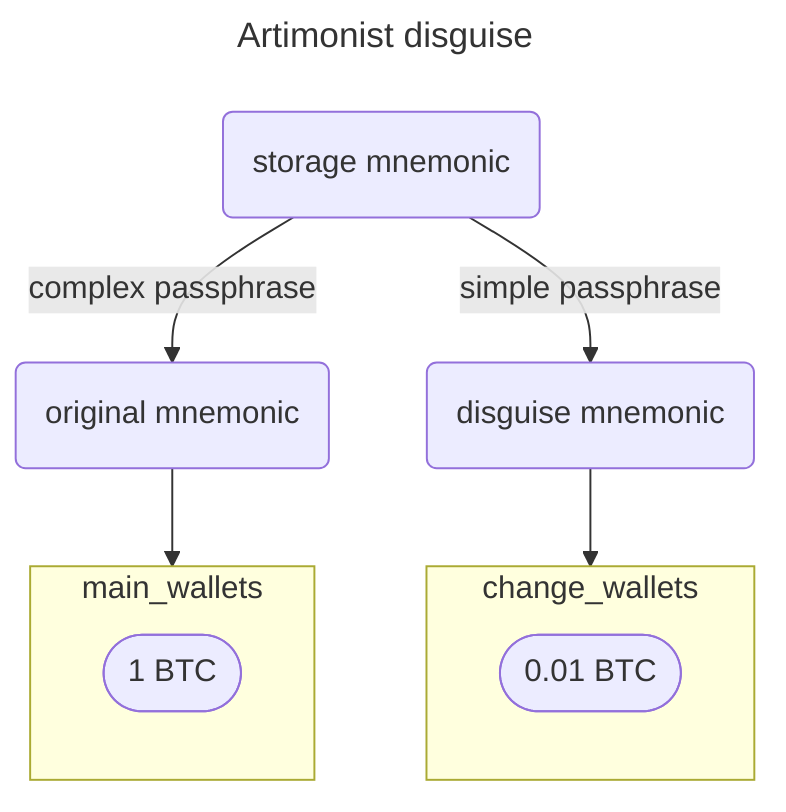

# [Artimonist](https://github.com/artimonist) disguise
Disguise mnemonics and wallets in a simple way.

  
How to generate it?
  

  #### original mnemonic     
  `disguise translate "hurdle clarify loop bid tray proud knife maximum twin chuckle luggage also" --language chinese`  
  ###### "肉 声 访 最 御 邦 赶 爸 捉 务 迹 法"

  #### storage mnemonic  
  `disguise encrypt "肉 声 访 最 御 邦 赶 爸 捉 务 迹 法" --password "P&KfPF%@5wgkBiGux3WU"`  
  ###### "栽 刮 铒 兴 粗 雪 玄 果 权 圣 吃 化; 阴"

  #### disguise mnemonic  
  `disguise decrypt "栽 刮 铒 兴 粗 雪 玄 果 权 圣 吃 化" --password "Thanks Satoshi!"`  
  ###### "访 案 硬 姻 逆 粗 框 但 塞 币 叫 黄"

  #### check results  
  `disguise decrypt "栽 刮 铒 兴 粗 雪 玄 果 权 圣 吃 化; 阴" --password "P&KfPF%@5wgkBiGux3WU"`  
  ###### "肉 声 访 最 御 邦 赶 爸 捉 务 迹 法"  
  
  `disguise translate "肉 声 访 最 御 邦 赶 爸 捉 务 迹 法" --language english`  
  ###### "hurdle clarify loop bid tray proud knife maximum twin chuckle luggage also"
  
  `disguise decrypt "栽 刮 铒 兴 粗 雪 玄 果 权 圣 吃 化" --password "Thanks Satoshi!"`  
  ###### "访 案 硬 姻 逆 粗 框 但 塞 币 叫 黄"

[See how it works?](docs/mnemonic_encrypt.mmd)
