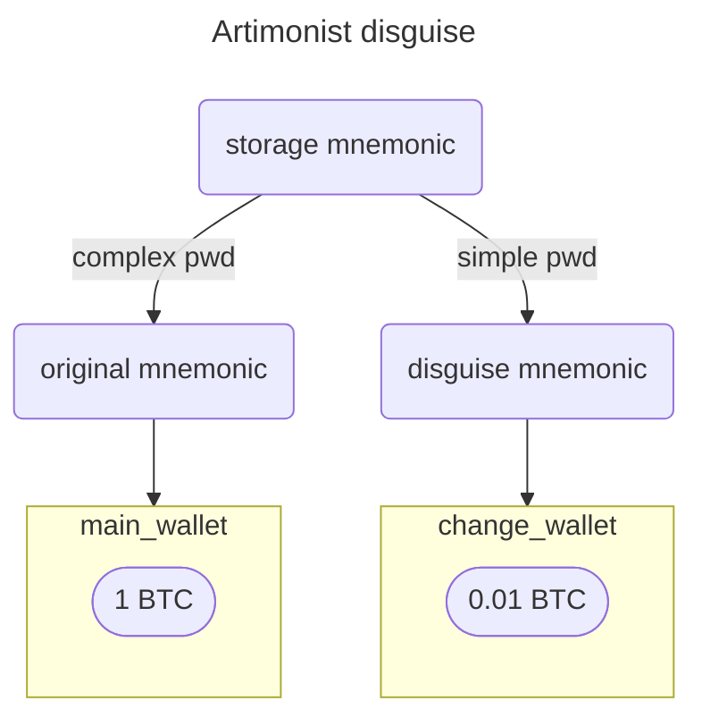

# disguise
Disguise mnemonics and wallets in a simple way.

```mermaid
---
  title: Artimonist disguise
---
flowchart TD
    X(original mnemonic)
    Y(storage mnemonic)
    Z(disguise mnemonic)

    Y -->|complex pwd| X
    Y -->|simple pwd| Z
    X --> main_wallet
    Z --> change_wallet

    subgraph main_wallet
      W1([1 BTC])
    end

    subgraph change_wallet
      W2([0.01 BTC])
    end
```